# Medieval ornaments

Reusable painted decorations and editable border designs, with PNG, lossless WebP, and smaller raster sizes. This repository is separate from [medieval-cutouts](https://github.com/adrian729/medieval-cutouts).

## Install and integrate

```sh
npm install @ranx729/medieval-ornaments
```

Dependency-free vanilla JavaScript, optional React components, TypeScript declarations, and categorized discovery use the same normalized contract. See the [integration guide](https://github.com/adrian729/medieval-ornaments/blob/main/docs/INTEGRATION.md), [plain JS example](https://adrian729.github.io/medieval-ornaments/examples/vanilla/), [React example](https://adrian729.github.io/medieval-ornaments/examples/react/), and [browser ZIP](https://adrian729.github.io/medieval-ornaments/medieval-ornaments-browser.zip).

```js
import { createDivider } from '@ranx729/medieval-ornaments';
import '@ranx729/medieval-ornaments/styles.css';

const divider = createDivider(element, {
  design: 'plate-02-stepped-ribbon', orientation: 'horizontal', length: '100%'
});
// divider.update({ orientation: 'vertical' });
// divider.destroy();
```

```jsx
import { OrnamentDivider, OrnamentFrame, OrnamentImage } from '@ranx729/medieval-ornaments/react';

<OrnamentDivider design="plate-02-stepped-ribbon" />
<OrnamentDivider design="plate-02-stepped-ribbon" orientation="horizontal" />
<OrnamentFrame design="red-berry-vine" size={33}><YourContent /></OrnamentFrame>
<OrnamentImage design="floral-bird-panel-blue" size={128} />
```

React includes the shared stylesheet automatically. Use `/react/unstyled` for plain Node SSR or centrally managed CSS; see the [React integration guide](docs/INTEGRATION.md#react).

Only `design` is required. Dividers default to the chosen artwork's original direction; horizontal/vertical automatically choose matching assets. Geometry, formats, and smaller raster sizes come from the catalog. Import `findOrnaments({ use: 'frame', categories: ['floral'] })` to discover compatible designs. Version 0.3.0 supports 56 repeat designs and 14 whole decorations.

Images default to version-pinned CDN URLs and load only when selected. To self-host:

```sh
npx medieval-ornaments copy-assets public/ornaments --design red-berry-vine
```

Pass `assetsBase: '/ornaments/'` in vanilla or `assetsBase="/ornaments/"` in React. No artwork build or Python is needed by consumers. The integration code has a scoped [MIT license](LICENSE); artwork retains its separately documented [rights status](ASSET-RIGHTS.md).

## Artwork collection

- **6 floral border styles:** editable vectors inspired by the supplied sheet, with complete motifs and matching corners.
- **38 numbered plate designs:** original painted pixels cut into audited units, plus editable color traces and untouched reference crops. Alternating motifs/colors and native proportions are retained. Plate 11, 16, 36, and 37 are whole decorations because the supplied regions do not establish a usable repeating strip.
- **5 painted vertical ornaments:** transparent AI-assisted extractions; complete decorations rather than seamless tiles.
- **21 audited source additions:** blue borders and grid-paper stencils, the requested digital strips 2/4, painted panels, and the russet floral border. Sixteen are repeats; five remain whole decorations. See [ADDITIONS.md](ADDITIONS.md).

The 56 repeating styles include matching corners and a frame atlas. Painted plate frames use source pixels with reflected miter corners; their SVG alternatives are color traces, not exact historical reproductions. The original sheet, crop choices, repeat rationale, and traces are preserved in the repository.

## Preview and use

Open the [small usage demo](https://adrian729.github.io/medieval-ornaments/) for a decorated card, repeating divider, and painted flourish, with copyable HTML/CSS. It includes a dark background, frame choices, and border thickness controls. The [design browser](https://adrian729.github.io/medieval-ornaments/examples/) groups designs by use: frames, repeating dividers, or whole painted decorations. Filter by category, search subjects or colors, and choose a visual preview card. Preview controls apply to the selected use.

Use [ornaments.css](ornaments.css) for consistent classes: `ornament-frame`, `ornament-divider`, and `ornament-image`. Set `--ornament-image` and `--ornament-size`; the stylesheet handles the shared geometry. [Usage details and exceptions](USAGE.md#shared-usage-contract) explain the optional settings.

Run `python3 -m http.server 8765` in this folder and open [the interactive preview](http://localhost:8765/examples/). Frames offer width, height, and thickness; dividers offer orientation, available length, and thickness; painted decorations offer image height. Divider sections remain complete and centered within the available length. Switch between available formats and inspect the original reference where available. Every repeat tile includes a rotated version for using it in either direction with the shared CSS.

The [artwork review page](https://adrian729.github.io/medieval-ornaments/examples/review.html) compares originals, extracted units, repeated strips, and frames at 33px. Switch between painted raster artwork and SVG traces.

The [source-additions review](https://adrian729.github.io/medieval-ornaments/examples/review.html?collection=additions) compares the 21 additions against their original crops. Grid-paper stencil backgrounds are retained; their grid lines have a different period and can show at joins. The temporary testing page has been removed, and watermarked candidates are excluded.

The demo is also at `examples/demo.html`; serve the local checkout as described above so it can load the catalog.

```html

```

For a scalable frame:

```css
.ornament-frame {
  --ornament-image: url("https://adrian729.github.io/medieval-ornaments/svg/red-berry-vine-border.svg");
  --ornament-size: 32px;
}
```

Include `ornaments.css` once and add `class="ornament-frame"` to your element.

Frames fit whole repeat units with `round`, so the edges end at the phase expected by their corners. Partial periods can cut motifs and are not an offered frame option. Use the supplied atlas rather than rotating source-derived corners yourself. See [usage details](USAGE.md) and [selection guidance for LLMs](SELECTION.md).

## Formats and sizes

`images.json` is the machine-readable catalog. `png/` and `webp/` contain masters; subfolders `128/`, `256/`, `512/`, and `768/` contain variants whose longest dimension is at most that size. A variant exists only when smaller than its master. Every size is made directly from the master; original raster artwork is never enlarged. SVGs are resolution-independent. Floral vector raster masters are at most 1024px. Numbered plate raster tiles, corners, and frames retain native source pixels. Atlas exports use integer slice boundaries; a size is omitted when it cannot meet that constraint without enlargement. Read actual dimensions from the catalog.

Painted ornament PNGs retain transparent backgrounds and are capped at the supplied image's 650px height. Exact reference crops retain their original paper/background; the two L-shaped corner crops mask neighboring designs. PNG and WebP pairs have identical dimensions, alpha, and visible pixels.

## Maintain the collection

Read [AGENTS.md](AGENTS.md) before editing. Install and regenerate:

```sh
python3 -m venv --system-site-packages .venv
.venv/bin/python -m pip install -r requirements.txt
.venv/bin/python scripts/build_assets.py
.venv/bin/python scripts/catalog.py
.venv/bin/python scripts/catalog.py --check
```

The five extraction prompts and method are recorded in [EXTRACTION-PROMPTS.json](EXTRACTION-PROMPTS.json). Reference crop coordinates are in [reference-crops.json](reference-crops.json). Repeat/whole decisions and join adjustments are recorded in [source-patterns.json](source-patterns.json). Optional retracing uses Python 3.12 with `requirements-trace.txt`; normal builds use the checked-in traces. Asset metadata records whether artwork is an extraction, reconstruction, source crop/color trace, or reference crop. This repository does not establish ownership or a blanket license for the supplied reference artwork; no source attribution has been invented. The ornament vector code and exported artwork assets are provided without a blanket license until provenance is established. The npm integration software's grant is scoped separately in [LICENSE](LICENSE).

## Develop and release the library

```sh
npm ci
npm run build
npm test
npm run test:types
npm run test:integration
npm run build:browser
npm pack
```

The library build generates metadata/types from `images.json` without changing artwork. Consumer checks install a real archive and exercise native/bundled vanilla, React 18/19, production/development, SSR/hydration, types, and self-hosting. Chromium is required for browser checks. The Pages workflow builds the React example and browser download. Follow [the integration guide's release steps](docs/INTEGRATION.md#examples-and-development) and record results in [QA.md](QA.md).

[Quality checks](QA.md) cover every exported file and all formats in the browser preview.

<!-- gallery:start -->
## Browse designs

| Category | Designs |
| --- | --- |
| `animals` | 5 |
| `botanical` | 42 |
| `floral` | 32 |
| `geometric` | 25 |
| `knotwork` | 2 |
| `ribbons` | 2 |
| `scrollwork` | 42 |

| Preview | Design | Type | Files |
| --- | --- | --- | --- |
|  | `blue-acanthus-and-seed-head-panel` | standalone | [PNG](png/blue-acanthus-and-seed-head-panel.png) · [WebP](webp/blue-acanthus-and-seed-head-panel.webp) · [SVG](svg/blue-acanthus-and-seed-head-panel.svg) · [Reference crop](png/blue-acanthus-and-seed-head-panel-reference.png) |
|  | `blue-alternating-leaf-vine` | repeat-tile | [PNG](png/blue-alternating-leaf-vine.png) · [WebP](webp/blue-alternating-leaf-vine.webp) · [SVG](svg/blue-alternating-leaf-vine.svg) · [Rotated tile](svg/blue-alternating-leaf-vine-rotated.svg) · [Corner](svg/blue-alternating-leaf-vine-corner.svg) · [Border atlas](svg/blue-alternating-leaf-vine-border.svg) · [Reference crop](png/blue-alternating-leaf-vine-reference.png) |
| 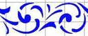 | `blue-alternating-stencil-scroll` | repeat-tile | [PNG](png/blue-alternating-stencil-scroll.png) · [WebP](webp/blue-alternating-stencil-scroll.webp) · [SVG](svg/blue-alternating-stencil-scroll.svg) · [Rotated tile](svg/blue-alternating-stencil-scroll-rotated.svg) · [Corner](svg/blue-alternating-stencil-scroll-corner.svg) · [Border atlas](svg/blue-alternating-stencil-scroll-border.svg) · [Reference crop](png/blue-alternating-stencil-scroll-reference.png) |
|  | `blue-diamond-leaf-stencil-band` | repeat-tile | [PNG](png/blue-diamond-leaf-stencil-band.png) · [WebP](webp/blue-diamond-leaf-stencil-band.webp) · [SVG](svg/blue-diamond-leaf-stencil-band.svg) · [Rotated tile](svg/blue-diamond-leaf-stencil-band-rotated.svg) · [Corner](svg/blue-diamond-leaf-stencil-band-corner.svg) · [Border atlas](svg/blue-diamond-leaf-stencil-band-border.svg) · [Reference crop](png/blue-diamond-leaf-stencil-band-reference.png) |
|  | `blue-four-petal-stencil-vine` | repeat-tile | [PNG](png/blue-four-petal-stencil-vine.png) · [WebP](webp/blue-four-petal-stencil-vine.webp) · [SVG](svg/blue-four-petal-stencil-vine.svg) · [Rotated tile](svg/blue-four-petal-stencil-vine-rotated.svg) · [Corner](svg/blue-four-petal-stencil-vine-corner.svg) · [Border atlas](svg/blue-four-petal-stencil-vine-border.svg) · [Reference crop](png/blue-four-petal-stencil-vine-reference.png) |
|  | `blue-looped-quatrefoils` | repeat-tile | [PNG](png/blue-looped-quatrefoils.png) · [WebP](webp/blue-looped-quatrefoils.webp) · [SVG](svg/blue-looped-quatrefoils.svg) · [Rotated tile](svg/blue-looped-quatrefoils-rotated.svg) · [Corner](svg/blue-looped-quatrefoils-corner.svg) · [Border atlas](svg/blue-looped-quatrefoils-border.svg) · [Reference crop](png/blue-looped-quatrefoils-reference.png) |
|  | `blue-paired-birds-and-palmettes` | repeat-tile | [PNG](png/blue-paired-birds-and-palmettes.png) · [WebP](webp/blue-paired-birds-and-palmettes.webp) · [SVG](svg/blue-paired-birds-and-palmettes.svg) · [Rotated tile](svg/blue-paired-birds-and-palmettes-rotated.svg) · [Corner](svg/blue-paired-birds-and-palmettes-corner.svg) · [Border atlas](svg/blue-paired-birds-and-palmettes-border.svg) · [Reference crop](png/blue-paired-birds-and-palmettes-reference.png) |
|  | `blue-staggered-leaf-scrolls` | repeat-tile | [PNG](png/blue-staggered-leaf-scrolls.png) · [WebP](webp/blue-staggered-leaf-scrolls.webp) · [SVG](svg/blue-staggered-leaf-scrolls.svg) · [Rotated tile](svg/blue-staggered-leaf-scrolls-rotated.svg) · [Corner](svg/blue-staggered-leaf-scrolls-corner.svg) · [Border atlas](svg/blue-staggered-leaf-scrolls-border.svg) · [Reference crop](png/blue-staggered-leaf-scrolls-reference.png) |
|  | `butterfly-panel-red` | standalone | [PNG](png/butterfly-panel-red.png) · [WebP](webp/butterfly-panel-red.webp) |
| 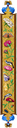 | `floral-bird-panel-blue` | standalone | [PNG](png/floral-bird-panel-blue.png) · [WebP](webp/floral-bird-panel-blue.webp) |
|  | `floral-bird-panel-left` | standalone | [PNG](png/floral-bird-panel-left.png) · [WebP](webp/floral-bird-panel-left.webp) |
|  | `floral-bird-panel-right` | standalone | [PNG](png/floral-bird-panel-right.png) · [WebP](webp/floral-bird-panel-right.webp) |
| 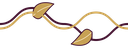 | `gold-leaf-scroll` | repeat-tile | [PNG](png/gold-leaf-scroll.png) · [WebP](webp/gold-leaf-scroll.webp) · [SVG](svg/gold-leaf-scroll.svg) · [Rotated tile](svg/gold-leaf-scroll-rotated.svg) · [Corner](svg/gold-leaf-scroll-corner.svg) · [Border atlas](svg/gold-leaf-scroll-border.svg) |
| 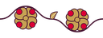 | `gold-quatrefoil-vine` | repeat-tile | [PNG](png/gold-quatrefoil-vine.png) · [WebP](webp/gold-quatrefoil-vine.webp) · [SVG](svg/gold-quatrefoil-vine.svg) · [Rotated tile](svg/gold-quatrefoil-vine-rotated.svg) · [Corner](svg/gold-quatrefoil-vine-corner.svg) · [Border atlas](svg/gold-quatrefoil-vine-border.svg) |
|  | `gold-scroll-with-blue-bellflowers` | standalone | [PNG](png/gold-scroll-with-blue-bellflowers.png) · [WebP](webp/gold-scroll-with-blue-bellflowers.webp) · [SVG](svg/gold-scroll-with-blue-bellflowers.svg) · [Reference crop](png/gold-scroll-with-blue-bellflowers-reference.png) |
|  | `interlocking-ribbon` | repeat-tile | [PNG](png/interlocking-ribbon.png) · [WebP](webp/interlocking-ribbon.webp) · [SVG](svg/interlocking-ribbon.svg) · [Rotated tile](svg/interlocking-ribbon-rotated.svg) · [Corner](svg/interlocking-ribbon-corner.svg) · [Border atlas](svg/interlocking-ribbon-border.svg) |
|  | `olive-leaf-and-red-berry-vine` | repeat-tile | [PNG](png/olive-leaf-and-red-berry-vine.png) · [WebP](webp/olive-leaf-and-red-berry-vine.webp) · [SVG](svg/olive-leaf-and-red-berry-vine.svg) · [Rotated tile](svg/olive-leaf-and-red-berry-vine-rotated.svg) · [Corner](svg/olive-leaf-and-red-berry-vine-corner.svg) · [Border atlas](svg/olive-leaf-and-red-berry-vine-border.svg) · [Reference crop](png/olive-leaf-and-red-berry-vine-reference.png) |
|  | `painted-opposed-serrated-flower-vine` | repeat-tile | [PNG](png/painted-opposed-serrated-flower-vine.png) · [WebP](webp/painted-opposed-serrated-flower-vine.webp) · [SVG](svg/painted-opposed-serrated-flower-vine.svg) · [Rotated tile](svg/painted-opposed-serrated-flower-vine-rotated.svg) · [Corner](svg/painted-opposed-serrated-flower-vine-corner.svg) · [Border atlas](svg/painted-opposed-serrated-flower-vine-border.svg) · [Reference crop](png/painted-opposed-serrated-flower-vine-reference.png) |
|  | `painted-rosette-and-fan-vine` | repeat-tile | [PNG](png/painted-rosette-and-fan-vine.png) · [WebP](webp/painted-rosette-and-fan-vine.webp) · [SVG](svg/painted-rosette-and-fan-vine.svg) · [Rotated tile](svg/painted-rosette-and-fan-vine-rotated.svg) · [Corner](svg/painted-rosette-and-fan-vine-corner.svg) · [Border atlas](svg/painted-rosette-and-fan-vine-border.svg) · [Reference crop](png/painted-rosette-and-fan-vine-reference.png) |
|  | `painted-sprawling-floral-panel` | standalone | [PNG](png/painted-sprawling-floral-panel.png) · [WebP](webp/painted-sprawling-floral-panel.webp) · [SVG](svg/painted-sprawling-floral-panel.svg) · [Reference crop](png/painted-sprawling-floral-panel-reference.png) |
|  | `painted-symmetric-leaf-and-flower-panel` | standalone | [PNG](png/painted-symmetric-leaf-and-flower-panel.png) · [WebP](webp/painted-symmetric-leaf-and-flower-panel.webp) · [SVG](svg/painted-symmetric-leaf-and-flower-panel.svg) · [Reference crop](png/painted-symmetric-leaf-and-flower-panel-reference.png) |
|  | `painted-three-band-floral-panel` | standalone | [PNG](png/painted-three-band-floral-panel.png) · [WebP](webp/painted-three-band-floral-panel.webp) · [SVG](svg/painted-three-band-floral-panel.svg) · [Reference crop](png/painted-three-band-floral-panel-reference.png) |
|  | `plate-01-linked-scrolls` | repeat-tile | [PNG](png/plate-01-linked-scrolls.png) · [WebP](webp/plate-01-linked-scrolls.webp) · [SVG](svg/plate-01-linked-scrolls.svg) · [Rotated tile](svg/plate-01-linked-scrolls-rotated.svg) · [Corner](svg/plate-01-linked-scrolls-corner.svg) · [Border atlas](svg/plate-01-linked-scrolls-border.svg) · [Reference crop](png/plate-01-linked-scrolls-reference.png) |
|  | `plate-02-stepped-ribbon` | repeat-tile | [PNG](png/plate-02-stepped-ribbon.png) · [WebP](webp/plate-02-stepped-ribbon.webp) · [SVG](svg/plate-02-stepped-ribbon.svg) · [Rotated tile](svg/plate-02-stepped-ribbon-rotated.svg) · [Corner](svg/plate-02-stepped-ribbon-corner.svg) · [Border atlas](svg/plate-02-stepped-ribbon-border.svg) · [Reference crop](png/plate-02-stepped-ribbon-reference.png) |
|  | `plate-03-spiral-bands` | repeat-tile | [PNG](png/plate-03-spiral-bands.png) · [WebP](webp/plate-03-spiral-bands.webp) · [SVG](svg/plate-03-spiral-bands.svg) · [Rotated tile](svg/plate-03-spiral-bands-rotated.svg) · [Corner](svg/plate-03-spiral-bands-corner.svg) · [Border atlas](svg/plate-03-spiral-bands-border.svg) · [Reference crop](png/plate-03-spiral-bands-reference.png) |
|  | `plate-04-heart-and-diamond` | repeat-tile | [PNG](png/plate-04-heart-and-diamond.png) · [WebP](webp/plate-04-heart-and-diamond.webp) · [SVG](svg/plate-04-heart-and-diamond.svg) · [Rotated tile](svg/plate-04-heart-and-diamond-rotated.svg) · [Corner](svg/plate-04-heart-and-diamond-corner.svg) · [Border atlas](svg/plate-04-heart-and-diamond-border.svg) · [Reference crop](png/plate-04-heart-and-diamond-reference.png) |
|  | `plate-05-blue-curls` | repeat-tile | [PNG](png/plate-05-blue-curls.png) · [WebP](webp/plate-05-blue-curls.webp) · [SVG](svg/plate-05-blue-curls.svg) · [Rotated tile](svg/plate-05-blue-curls-rotated.svg) · [Corner](svg/plate-05-blue-curls-corner.svg) · [Border atlas](svg/plate-05-blue-curls-border.svg) · [Reference crop](png/plate-05-blue-curls-reference.png) |
|  | `plate-06-paired-red-scrolls` | repeat-tile | [PNG](png/plate-06-paired-red-scrolls.png) · [WebP](webp/plate-06-paired-red-scrolls.webp) · [SVG](svg/plate-06-paired-red-scrolls.svg) · [Rotated tile](svg/plate-06-paired-red-scrolls-rotated.svg) · [Corner](svg/plate-06-paired-red-scrolls-corner.svg) · [Border atlas](svg/plate-06-paired-red-scrolls-border.svg) · [Reference crop](png/plate-06-paired-red-scrolls-reference.png) |
|  | `plate-07-blue-heart-leaves` | repeat-tile | [PNG](png/plate-07-blue-heart-leaves.png) · [WebP](webp/plate-07-blue-heart-leaves.webp) · [SVG](svg/plate-07-blue-heart-leaves.svg) · [Rotated tile](svg/plate-07-blue-heart-leaves-rotated.svg) · [Corner](svg/plate-07-blue-heart-leaves-corner.svg) · [Border atlas](svg/plate-07-blue-heart-leaves-border.svg) · [Reference crop](png/plate-07-blue-heart-leaves-reference.png) |
|  | `plate-08-diagonal-cross` | repeat-tile | [PNG](png/plate-08-diagonal-cross.png) · [WebP](webp/plate-08-diagonal-cross.webp) · [SVG](svg/plate-08-diagonal-cross.svg) · [Rotated tile](svg/plate-08-diagonal-cross-rotated.svg) · [Corner](svg/plate-08-diagonal-cross-corner.svg) · [Border atlas](svg/plate-08-diagonal-cross-border.svg) · [Reference crop](png/plate-08-diagonal-cross-reference.png) |
|  | `plate-09-interlaced-knot` | repeat-tile | [PNG](png/plate-09-interlaced-knot.png) · [WebP](webp/plate-09-interlaced-knot.webp) · [SVG](svg/plate-09-interlaced-knot.svg) · [Rotated tile](svg/plate-09-interlaced-knot-rotated.svg) · [Corner](svg/plate-09-interlaced-knot-corner.svg) · [Border atlas](svg/plate-09-interlaced-knot-border.svg) · [Reference crop](png/plate-09-interlaced-knot-reference.png) |
|  | `plate-10-blue-palmettes` | repeat-tile | [PNG](png/plate-10-blue-palmettes.png) · [WebP](webp/plate-10-blue-palmettes.webp) · [SVG](svg/plate-10-blue-palmettes.svg) · [Rotated tile](svg/plate-10-blue-palmettes-rotated.svg) · [Corner](svg/plate-10-blue-palmettes-corner.svg) · [Border atlas](svg/plate-10-blue-palmettes-border.svg) · [Reference crop](png/plate-10-blue-palmettes-reference.png) |
|  | `plate-11-acanthus-scroll` | standalone | [PNG](png/plate-11-acanthus-scroll.png) · [WebP](webp/plate-11-acanthus-scroll.webp) · [SVG](svg/plate-11-acanthus-scroll.svg) · [Reference crop](png/plate-11-acanthus-scroll-reference.png) |
|  | `plate-12-arched-diamonds` | repeat-tile | [PNG](png/plate-12-arched-diamonds.png) · [WebP](webp/plate-12-arched-diamonds.webp) · [SVG](svg/plate-12-arched-diamonds.svg) · [Rotated tile](svg/plate-12-arched-diamonds-rotated.svg) · [Corner](svg/plate-12-arched-diamonds-corner.svg) · [Border atlas](svg/plate-12-arched-diamonds-border.svg) · [Reference crop](png/plate-12-arched-diamonds-reference.png) |
|  | `plate-13-leaf-and-flower-vine` | repeat-tile | [PNG](png/plate-13-leaf-and-flower-vine.png) · [WebP](webp/plate-13-leaf-and-flower-vine.webp) · [SVG](svg/plate-13-leaf-and-flower-vine.svg) · [Rotated tile](svg/plate-13-leaf-and-flower-vine-rotated.svg) · [Corner](svg/plate-13-leaf-and-flower-vine-corner.svg) · [Border atlas](svg/plate-13-leaf-and-flower-vine-border.svg) · [Reference crop](png/plate-13-leaf-and-flower-vine-reference.png) |
|  | `plate-14-crossed-diamonds` | repeat-tile | [PNG](png/plate-14-crossed-diamonds.png) · [WebP](webp/plate-14-crossed-diamonds.webp) · [SVG](svg/plate-14-crossed-diamonds.svg) · [Rotated tile](svg/plate-14-crossed-diamonds-rotated.svg) · [Corner](svg/plate-14-crossed-diamonds-corner.svg) · [Border atlas](svg/plate-14-crossed-diamonds-border.svg) · [Reference crop](png/plate-14-crossed-diamonds-reference.png) |
|  | `plate-15-diamond-square` | repeat-tile | [PNG](png/plate-15-diamond-square.png) · [WebP](webp/plate-15-diamond-square.webp) · [SVG](svg/plate-15-diamond-square.svg) · [Rotated tile](svg/plate-15-diamond-square-rotated.svg) · [Corner](svg/plate-15-diamond-square-corner.svg) · [Border atlas](svg/plate-15-diamond-square-border.svg) · [Reference crop](png/plate-15-diamond-square-reference.png) |
|  | `plate-16-stepped-corner` | standalone | [PNG](png/plate-16-stepped-corner.png) · [WebP](webp/plate-16-stepped-corner.webp) · [SVG](svg/plate-16-stepped-corner.svg) · [Reference crop](png/plate-16-stepped-corner-reference.png) |
| 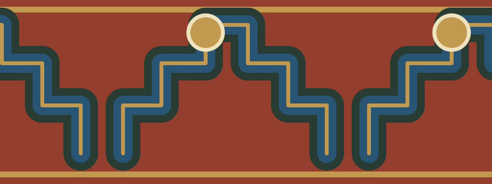 | `plate-17-stepped-arches` | repeat-tile | [PNG](png/plate-17-stepped-arches.png) · [WebP](webp/plate-17-stepped-arches.webp) · [SVG](svg/plate-17-stepped-arches.svg) · [Rotated tile](svg/plate-17-stepped-arches-rotated.svg) · [Corner](svg/plate-17-stepped-arches-corner.svg) · [Border atlas](svg/plate-17-stepped-arches-border.svg) · [Reference crop](png/plate-17-stepped-arches-reference.png) |
| 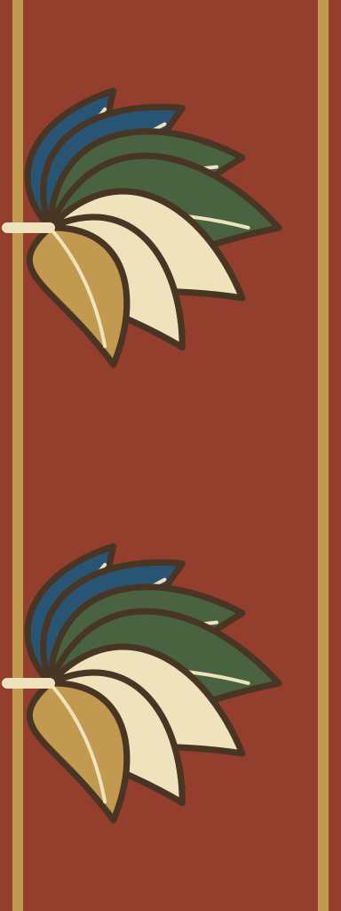 | `plate-18-fan-palmettes` | repeat-tile | [PNG](png/plate-18-fan-palmettes.png) · [WebP](webp/plate-18-fan-palmettes.webp) · [SVG](svg/plate-18-fan-palmettes.svg) · [Rotated tile](svg/plate-18-fan-palmettes-rotated.svg) · [Corner](svg/plate-18-fan-palmettes-corner.svg) · [Border atlas](svg/plate-18-fan-palmettes-border.svg) · [Reference crop](png/plate-18-fan-palmettes-reference.png) |
|  | `plate-19-cream-scrolls` | repeat-tile | [PNG](png/plate-19-cream-scrolls.png) · [WebP](webp/plate-19-cream-scrolls.webp) · [SVG](svg/plate-19-cream-scrolls.svg) · [Rotated tile](svg/plate-19-cream-scrolls-rotated.svg) · [Corner](svg/plate-19-cream-scrolls-corner.svg) · [Border atlas](svg/plate-19-cream-scrolls-border.svg) · [Reference crop](png/plate-19-cream-scrolls-reference.png) |
| 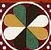 | `plate-20-segmented-medallions` | repeat-tile | [PNG](png/plate-20-segmented-medallions.png) · [WebP](webp/plate-20-segmented-medallions.webp) · [SVG](svg/plate-20-segmented-medallions.svg) · [Rotated tile](svg/plate-20-segmented-medallions-rotated.svg) · [Corner](svg/plate-20-segmented-medallions-corner.svg) · [Border atlas](svg/plate-20-segmented-medallions-border.svg) · [Reference crop](png/plate-20-segmented-medallions-reference.png) |
| 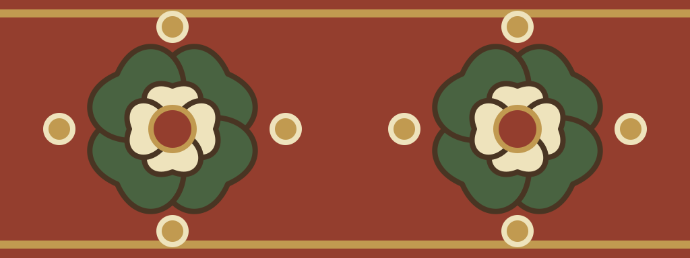 | `plate-21-green-flower-medallions` | repeat-tile | [PNG](png/plate-21-green-flower-medallions.png) · [WebP](webp/plate-21-green-flower-medallions.webp) · [SVG](svg/plate-21-green-flower-medallions.svg) · [Rotated tile](svg/plate-21-green-flower-medallions-rotated.svg) · [Corner](svg/plate-21-green-flower-medallions-corner.svg) · [Border atlas](svg/plate-21-green-flower-medallions-border.svg) · [Reference crop](png/plate-21-green-flower-medallions-reference.png) |
| 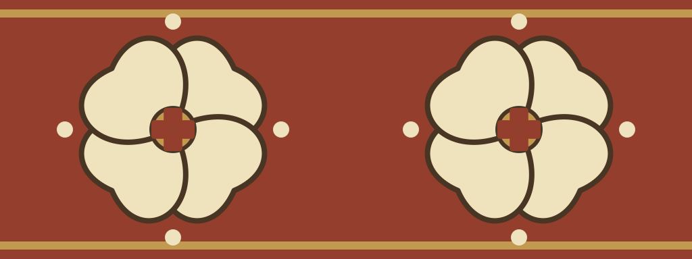 | `plate-22-white-petal-grid` | repeat-tile | [PNG](png/plate-22-white-petal-grid.png) · [WebP](webp/plate-22-white-petal-grid.webp) · [SVG](svg/plate-22-white-petal-grid.svg) · [Rotated tile](svg/plate-22-white-petal-grid-rotated.svg) · [Corner](svg/plate-22-white-petal-grid-corner.svg) · [Border atlas](svg/plate-22-white-petal-grid-border.svg) · [Reference crop](png/plate-22-white-petal-grid-reference.png) |
|  | `plate-23-crossed-ribbon-knots` | repeat-tile | [PNG](png/plate-23-crossed-ribbon-knots.png) · [WebP](webp/plate-23-crossed-ribbon-knots.webp) · [SVG](svg/plate-23-crossed-ribbon-knots.svg) · [Rotated tile](svg/plate-23-crossed-ribbon-knots-rotated.svg) · [Corner](svg/plate-23-crossed-ribbon-knots-corner.svg) · [Border atlas](svg/plate-23-crossed-ribbon-knots-border.svg) · [Reference crop](png/plate-23-crossed-ribbon-knots-reference.png) |
| 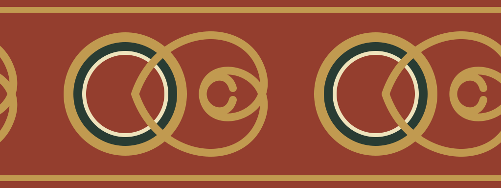 | `plate-24-gold-ring-scrolls` | repeat-tile | [PNG](png/plate-24-gold-ring-scrolls.png) · [WebP](webp/plate-24-gold-ring-scrolls.webp) · [SVG](svg/plate-24-gold-ring-scrolls.svg) · [Rotated tile](svg/plate-24-gold-ring-scrolls-rotated.svg) · [Corner](svg/plate-24-gold-ring-scrolls-corner.svg) · [Border atlas](svg/plate-24-gold-ring-scrolls-border.svg) · [Reference crop](png/plate-24-gold-ring-scrolls-reference.png) |
|  | `plate-25-greek-crosses` | repeat-tile | [PNG](png/plate-25-greek-crosses.png) · [WebP](webp/plate-25-greek-crosses.webp) · [SVG](svg/plate-25-greek-crosses.svg) · [Rotated tile](svg/plate-25-greek-crosses-rotated.svg) · [Corner](svg/plate-25-greek-crosses-corner.svg) · [Border atlas](svg/plate-25-greek-crosses-border.svg) · [Reference crop](png/plate-25-greek-crosses-reference.png) |
|  | `plate-26-eight-petal-rosette` | repeat-tile | [PNG](png/plate-26-eight-petal-rosette.png) · [WebP](webp/plate-26-eight-petal-rosette.webp) · [SVG](svg/plate-26-eight-petal-rosette.svg) · [Rotated tile](svg/plate-26-eight-petal-rosette-rotated.svg) · [Corner](svg/plate-26-eight-petal-rosette-corner.svg) · [Border atlas](svg/plate-26-eight-petal-rosette-border.svg) · [Reference crop](png/plate-26-eight-petal-rosette-reference.png) |
| 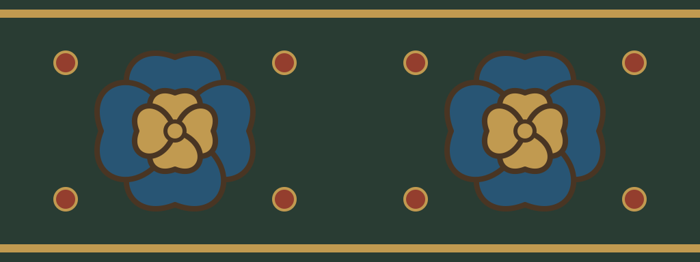 | `plate-27-blue-flower-medallions` | repeat-tile | [PNG](png/plate-27-blue-flower-medallions.png) · [WebP](webp/plate-27-blue-flower-medallions.webp) · [SVG](svg/plate-27-blue-flower-medallions.svg) · [Rotated tile](svg/plate-27-blue-flower-medallions-rotated.svg) · [Corner](svg/plate-27-blue-flower-medallions-corner.svg) · [Border atlas](svg/plate-27-blue-flower-medallions-border.svg) · [Reference crop](png/plate-27-blue-flower-medallions-reference.png) |
|  | `plate-28-angular-blue-meander` | repeat-tile | [PNG](png/plate-28-angular-blue-meander.png) · [WebP](webp/plate-28-angular-blue-meander.webp) · [SVG](svg/plate-28-angular-blue-meander.svg) · [Rotated tile](svg/plate-28-angular-blue-meander-rotated.svg) · [Corner](svg/plate-28-angular-blue-meander-corner.svg) · [Border atlas](svg/plate-28-angular-blue-meander-border.svg) · [Reference crop](png/plate-28-angular-blue-meander-reference.png) |
|  | `plate-29-red-acanthus` | repeat-tile | [PNG](png/plate-29-red-acanthus.png) · [WebP](webp/plate-29-red-acanthus.webp) · [SVG](svg/plate-29-red-acanthus.svg) · [Rotated tile](svg/plate-29-red-acanthus-rotated.svg) · [Corner](svg/plate-29-red-acanthus-corner.svg) · [Border atlas](svg/plate-29-red-acanthus-border.svg) · [Reference crop](png/plate-29-red-acanthus-reference.png) |
|  | `plate-30-layered-palmettes` | repeat-tile | [PNG](png/plate-30-layered-palmettes.png) · [WebP](webp/plate-30-layered-palmettes.webp) · [SVG](svg/plate-30-layered-palmettes.svg) · [Rotated tile](svg/plate-30-layered-palmettes-rotated.svg) · [Corner](svg/plate-30-layered-palmettes-corner.svg) · [Border atlas](svg/plate-30-layered-palmettes-border.svg) · [Reference crop](png/plate-30-layered-palmettes-reference.png) |
|  | `plate-31-alternating-florets` | repeat-tile | [PNG](png/plate-31-alternating-florets.png) · [WebP](webp/plate-31-alternating-florets.webp) · [SVG](svg/plate-31-alternating-florets.svg) · [Rotated tile](svg/plate-31-alternating-florets-rotated.svg) · [Corner](svg/plate-31-alternating-florets-corner.svg) · [Border atlas](svg/plate-31-alternating-florets-border.svg) · [Reference crop](png/plate-31-alternating-florets-reference.png) |
|  | `plate-32-linked-ovals` | repeat-tile | [PNG](png/plate-32-linked-ovals.png) · [WebP](webp/plate-32-linked-ovals.webp) · [SVG](svg/plate-32-linked-ovals.svg) · [Rotated tile](svg/plate-32-linked-ovals-rotated.svg) · [Corner](svg/plate-32-linked-ovals-corner.svg) · [Border atlas](svg/plate-32-linked-ovals-border.svg) · [Reference crop](png/plate-32-linked-ovals-reference.png) |
|  | `plate-33-leaf-scrolls` | repeat-tile | [PNG](png/plate-33-leaf-scrolls.png) · [WebP](webp/plate-33-leaf-scrolls.webp) · [SVG](svg/plate-33-leaf-scrolls.svg) · [Rotated tile](svg/plate-33-leaf-scrolls-rotated.svg) · [Corner](svg/plate-33-leaf-scrolls-corner.svg) · [Border atlas](svg/plate-33-leaf-scrolls-border.svg) · [Reference crop](png/plate-33-leaf-scrolls-reference.png) |
|  | `plate-34-nested-fans` | repeat-tile | [PNG](png/plate-34-nested-fans.png) · [WebP](webp/plate-34-nested-fans.webp) · [SVG](svg/plate-34-nested-fans.svg) · [Rotated tile](svg/plate-34-nested-fans-rotated.svg) · [Corner](svg/plate-34-nested-fans-corner.svg) · [Border atlas](svg/plate-34-nested-fans-border.svg) · [Reference crop](png/plate-34-nested-fans-reference.png) |
|  | `plate-35-crossed-white-stems` | repeat-tile | [PNG](png/plate-35-crossed-white-stems.png) · [WebP](webp/plate-35-crossed-white-stems.webp) · [SVG](svg/plate-35-crossed-white-stems.svg) · [Rotated tile](svg/plate-35-crossed-white-stems-rotated.svg) · [Corner](svg/plate-35-crossed-white-stems-corner.svg) · [Border atlas](svg/plate-35-crossed-white-stems-border.svg) · [Reference crop](png/plate-35-crossed-white-stems-reference.png) |
| 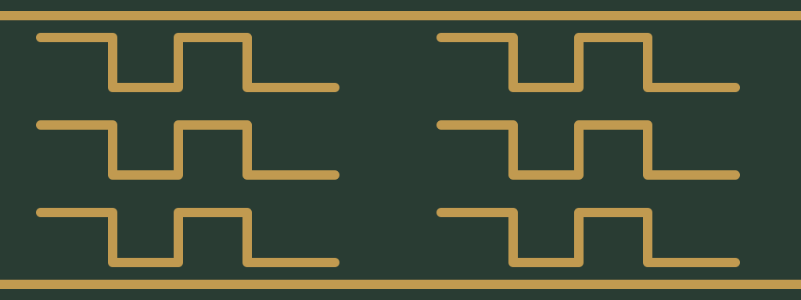 | `plate-36-greek-key` | standalone | [PNG](png/plate-36-greek-key.png) · [WebP](webp/plate-36-greek-key.webp) · [SVG](svg/plate-36-greek-key.svg) · [Reference crop](png/plate-36-greek-key-reference.png) |
| 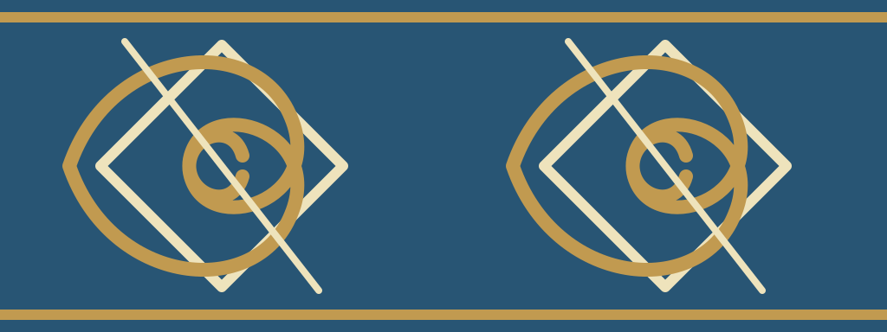 | `plate-37-diamond-scroll` | standalone | [PNG](png/plate-37-diamond-scroll.png) · [WebP](webp/plate-37-diamond-scroll.webp) · [SVG](svg/plate-37-diamond-scroll.svg) · [Reference crop](png/plate-37-diamond-scroll-reference.png) |
| 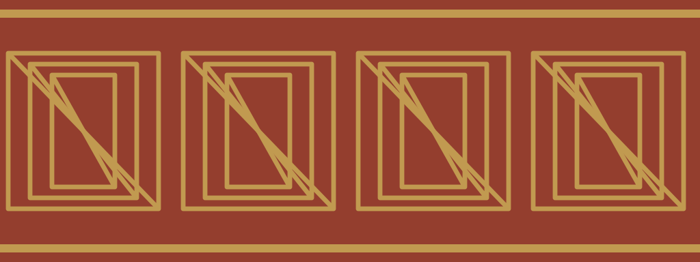 | `plate-38-diagonal-meander` | repeat-tile | [PNG](png/plate-38-diagonal-meander.png) · [WebP](webp/plate-38-diagonal-meander.webp) · [SVG](svg/plate-38-diagonal-meander.svg) · [Rotated tile](svg/plate-38-diagonal-meander-rotated.svg) · [Corner](svg/plate-38-diagonal-meander-corner.svg) · [Border atlas](svg/plate-38-diagonal-meander-border.svg) · [Reference crop](png/plate-38-diagonal-meander-reference.png) |
|  | `purple-fine-scroll-lattice` | repeat-tile | [PNG](png/purple-fine-scroll-lattice.png) · [WebP](webp/purple-fine-scroll-lattice.webp) · [SVG](svg/purple-fine-scroll-lattice.svg) · [Rotated tile](svg/purple-fine-scroll-lattice-rotated.svg) · [Corner](svg/purple-fine-scroll-lattice-corner.svg) · [Border atlas](svg/purple-fine-scroll-lattice-border.svg) · [Reference crop](png/purple-fine-scroll-lattice-reference.png) |
|  | `purple-opposed-scroll-vine` | repeat-tile | [PNG](png/purple-opposed-scroll-vine.png) · [WebP](webp/purple-opposed-scroll-vine.webp) · [SVG](svg/purple-opposed-scroll-vine.svg) · [Rotated tile](svg/purple-opposed-scroll-vine-rotated.svg) · [Corner](svg/purple-opposed-scroll-vine-corner.svg) · [Border atlas](svg/purple-opposed-scroll-vine-border.svg) · [Reference crop](png/purple-opposed-scroll-vine-reference.png) |
|  | `purple-oval-rosette-vine` | repeat-tile | [PNG](png/purple-oval-rosette-vine.png) · [WebP](webp/purple-oval-rosette-vine.webp) · [SVG](svg/purple-oval-rosette-vine.svg) · [Rotated tile](svg/purple-oval-rosette-vine-rotated.svg) · [Corner](svg/purple-oval-rosette-vine-corner.svg) · [Border atlas](svg/purple-oval-rosette-vine-border.svg) · [Reference crop](png/purple-oval-rosette-vine-reference.png) |
|  | `red-berry-vine` | repeat-tile | [PNG](png/red-berry-vine.png) · [WebP](webp/red-berry-vine.webp) · [SVG](svg/red-berry-vine.svg) · [Rotated tile](svg/red-berry-vine-rotated.svg) · [Corner](svg/red-berry-vine-corner.svg) · [Border atlas](svg/red-berry-vine-border.svg) |
|  | `red-rosette-vine` | repeat-tile | [PNG](png/red-rosette-vine.png) · [WebP](webp/red-rosette-vine.webp) · [SVG](svg/red-rosette-vine.svg) · [Rotated tile](svg/red-rosette-vine-rotated.svg) · [Corner](svg/red-rosette-vine-corner.svg) · [Border atlas](svg/red-rosette-vine-border.svg) |
| 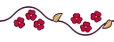 | `red-trefoil-vine` | repeat-tile | [PNG](png/red-trefoil-vine.png) · [WebP](webp/red-trefoil-vine.webp) · [SVG](svg/red-trefoil-vine.svg) · [Rotated tile](svg/red-trefoil-vine-rotated.svg) · [Corner](svg/red-trefoil-vine-corner.svg) · [Border atlas](svg/red-trefoil-vine-border.svg) |
|  | `russet-floral-vine-with-bud-borders` | repeat-tile | [PNG](png/russet-floral-vine-with-bud-borders.png) · [WebP](webp/russet-floral-vine-with-bud-borders.webp) · [SVG](svg/russet-floral-vine-with-bud-borders.svg) · [Rotated tile](svg/russet-floral-vine-with-bud-borders-rotated.svg) · [Corner](svg/russet-floral-vine-with-bud-borders-corner.svg) · [Border atlas](svg/russet-floral-vine-with-bud-borders-border.svg) · [Reference crop](png/russet-floral-vine-with-bud-borders-reference.png) |
|  | `russet-opposed-flowers-and-sage-leaves` | repeat-tile | [PNG](png/russet-opposed-flowers-and-sage-leaves.png) · [WebP](webp/russet-opposed-flowers-and-sage-leaves.webp) · [SVG](svg/russet-opposed-flowers-and-sage-leaves.svg) · [Rotated tile](svg/russet-opposed-flowers-and-sage-leaves-rotated.svg) · [Corner](svg/russet-opposed-flowers-and-sage-leaves-corner.svg) · [Border atlas](svg/russet-opposed-flowers-and-sage-leaves-border.svg) · [Reference crop](png/russet-opposed-flowers-and-sage-leaves-reference.png) |
| 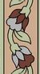 | `sage-leaf-and-russet-bud-vine` | repeat-tile | [PNG](png/sage-leaf-and-russet-bud-vine.png) · [WebP](webp/sage-leaf-and-russet-bud-vine.webp) · [SVG](svg/sage-leaf-and-russet-bud-vine.svg) · [Rotated tile](svg/sage-leaf-and-russet-bud-vine-rotated.svg) · [Corner](svg/sage-leaf-and-russet-bud-vine-corner.svg) · [Border atlas](svg/sage-leaf-and-russet-bud-vine-border.svg) · [Reference crop](png/sage-leaf-and-russet-bud-vine-reference.png) |
|  | `spiral-ribbon-column` | standalone | [PNG](png/spiral-ribbon-column.png) · [WebP](webp/spiral-ribbon-column.webp) |

<!-- gallery:end -->
